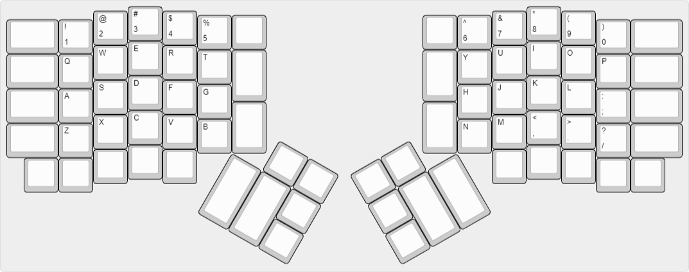

# layouts-ergodox

Selected layouts for the [ErgoDox keyboard](https://www.ergodox.io/), made with the [ErgoDox EZ Configurator](http://configure.ergodox-ez.com/keyboard_layouts/qdgrvo/edit), or with [qmk/qmk_firmware](https://github.com/qmk/qmk_firmware/tree/master/layouts/community/ergodox/teckinesis) code.

[Keyboard Layout Editor: ErgoDox Layout](http://www.keyboard-layout-editor.com/##@@_x:3.5%3B&=%23%0A3&_x:10.5%3B&=*%0A8%3B&@_y:-0.875&x:2.5%3B&=%2F@%0A2&_x:1%3B&=$%0A4&_x:8.5%3B&=%2F&%0A7&_x:1%3B&=(%0A9%3B&@_y:-0.875&x:5.5%3B&=%25%0A5&_a:7%3B&=&_x:4.5%3B&=&_a:4%3B&=%5E%0A6%3B&@_y:-0.875&a:7&w:1.5%3B&=&_a:4%3B&=!%0A1&_x:14.5%3B&=)%0A0&_a:7&w:1.5%3B&=%3B&@_y:-0.375&x:3.5&a:4%3B&=E&_x:10.5%3B&=I%3B&@_y:-0.875&x:2.5%3B&=W&_x:1%3B&=R&_x:8.5%3B&=U&_x:1%3B&=O%3B&@_y:-0.875&x:5.5%3B&=T&_a:7&h:1.5%3B&=&_x:4.5&h:1.5%3B&=&_a:4%3B&=Y%3B&@_y:-0.875&a:7&w:1.5%3B&=&_a:4%3B&=Q&_x:14.5%3B&=P&_a:7&w:1.5%3B&=%3B&@_y:-0.375&x:3.5&a:4%3B&=D&_x:10.5%3B&=K%3B&@_y:-0.875&x:2.5%3B&=S&_x:1%3B&=F&_x:8.5%3B&=J&_x:1%3B&=L%3B&@_y:-0.875&x:5.5%3B&=G&_x:6.5%3B&=H%3B&@_y:-0.875&a:7&w:1.5%3B&=&_a:4%3B&=A&_x:14.5%3B&=%2F:%0A%2F%3B&_a:7&w:1.5%3B&=%3B&@_y:-0.625&x:6.5&h:1.5%3B&=&_x:4.5&h:1.5%3B&=%3B&@_y:-0.75&x:3.5&a:4%3B&=C&_x:10.5%3B&=%3C%0A,%3B&@_y:-0.875&x:2.5%3B&=X&_x:1%3B&=V&_x:8.5%3B&=M&_x:1%3B&=%3E%0A.%3B&@_y:-0.875&x:5.5%3B&=B&_x:6.5%3B&=N%3B&@_y:-0.875&a:7&w:1.5%3B&=&_a:4%3B&=Z&_x:14.5%3B&=%3F%0A%2F%2F&_a:7&w:1.5%3B&=%3B&@_y:-0.375&x:3.5%3B&=&_x:10.5%3B&=%3B&@_y:-0.875&x:2.5%3B&=&_x:1%3B&=&_x:8.5%3B&=&_x:1%3B&=%3B&@_y:-0.75&x:0.5%3B&=&=&_x:14.5%3B&=&=%3B&@_r:30&rx:6.5&ry:4.25&y:-1&x:1%3B&=&=%3B&@_h:2%3B&=&_h:2%3B&=&=%3B&@_x:2%3B&=%3B&@_r:-30&rx:13&y:-1&x:-3%3B&=&=%3B&@_x:-3%3B&=&_h:2%3B&=&_h:2%3B&=%3B&@_x:-3%3B&=)

## Related Repositories

* https://github.com/qmk/qmk_firmware/tree/master/layouts/community/ergodox
    * https://github.com/qmk/qmk_firmware/tree/master/layouts/community/ergodox/ab
    * https://github.com/qmk/qmk_firmware/tree/master/layouts/community/ergodox/familiar
    * https://github.com/qmk/qmk_firmware/tree/master/layouts/community/ergodox/ordinary
    * https://github.com/qmk/qmk_firmware/tree/master/layouts/community/ergodox/teckinesis

* https://github.com/inkthink/an-alt-ergodox-ez-layout

* https://github.com/naps62/ergodox-layout

* 

## Further Reading

* [Unofficial Quick Reference to the ErgoDox EZ · inkthink/an-alt-ergodox-ez-layout Wiki](https://github.com/inkthink/an-alt-ergodox-ez-layout/wiki/Unofficial-Quick-Reference-to-the-ErgoDox-EZ)
* [My Ergodox EZ’s Custom Layout | implements Blog](https://implementsblog.com/2016/10/16/my-ergodox-ezs-custom-layout/)
