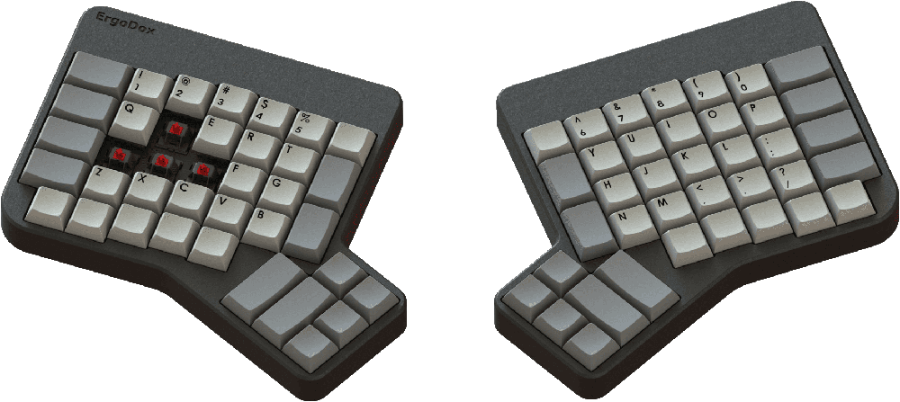

# layouts-ergodox

Selected layouts for the [ErgoDox keyboard](https://www.ergodox.io/), made with the [ErgoDox EZ Configurator](http://configure.ergodox-ez.com/keyboard_layouts/qdgrvo/edit), or with [qmk/qmk_firmware](https://github.com/qmk/qmk_firmware/tree/master/layouts/community/ergodox/teckinesis) code.

## Related Repositories

* https://github.com/qmk/qmk_firmware/tree/master/layouts/community/ergodox
    * https://github.com/qmk/qmk_firmware/tree/master/layouts/community/ergodox/ab
    * https://github.com/qmk/qmk_firmware/tree/master/layouts/community/ergodox/familiar
    * https://github.com/qmk/qmk_firmware/tree/master/layouts/community/ergodox/ordinary
    * https://github.com/qmk/qmk_firmware/tree/master/layouts/community/ergodox/teckinesis

* https://github.com/inkthink/an-alt-ergodox-ez-layout

* https://github.com/naps62/ergodox-layout

* 

## Further Reading

* [Unofficial Quick Reference to the ErgoDox EZ · inkthink/an-alt-ergodox-ez-layout Wiki](https://github.com/inkthink/an-alt-ergodox-ez-layout/wiki/Unofficial-Quick-Reference-to-the-ErgoDox-EZ)
* [My Ergodox EZ’s Custom Layout | implements Blog](https://implementsblog.com/2016/10/16/my-ergodox-ezs-custom-layout/)
